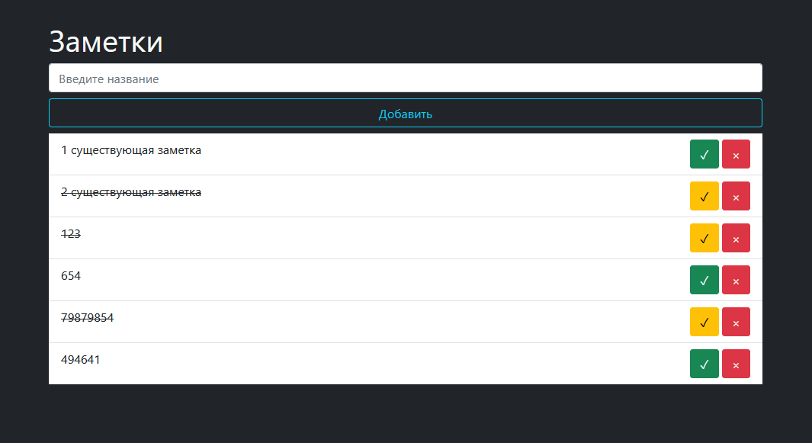

 
# https://bubenture.github.io/notes

A web application for creating and managing notes.

#### Creating a Note:
Users can enter text in the input field and click the "Add" button. The new note appears in the list below.

#### Marking as Completed:
Each note has a checkbox button. When clicked, the note is marked as completed (the text is struck through).

#### Deleting a Note:
Next to each note is a delete button (cross icon). When clicked, the note is removed from the list.

#### Visualization:
If there are no notes, a message "No notes available" is displayed.

#### Features:
- The entire application operates on the client side, with no server component.
- Notes are not saved between reloads (data is stored only in the browser's memory).
- Bootstrap is used for quick and modern styling.
- Simple and intuitive interface, easily extendable.
