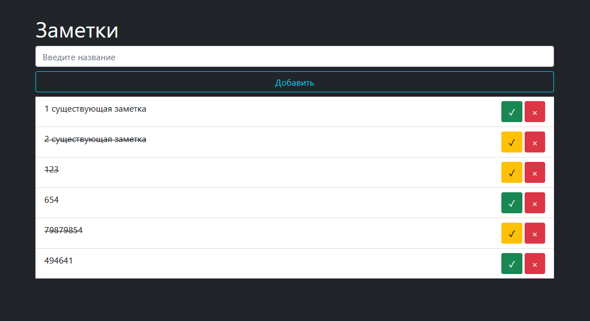

# 

Сайт-приложение для создания и управления заметками

#### Создание заметки:  
Пользователь вводит текст в поле и нажимает кнопку "Добавить". Новая заметка появляется в списке ниже.
#### Отметка о выполнении:  
У каждой заметки есть кнопка с галочкой. При нажатии на неё заметка помечается как выполненная (текст перечёркивается).
#### Удаление заметки:  
Рядом с каждой заметкой есть кнопка удаления (крестик). При нажатии заметка удаляется из списка.
#### Визуализация:  
Если заметок нет, отображается сообщение "Заметок нет".
#### Особенности
- Всё приложение работает на стороне клиента, без серверной части.
- Нет сохранения заметок между перезагрузками (данные хранятся только в оперативной памяти браузера).
- Используется Bootstrap для быстрой и современной стилизации.
- Простой и понятный интерфейс, легко расширяется.

